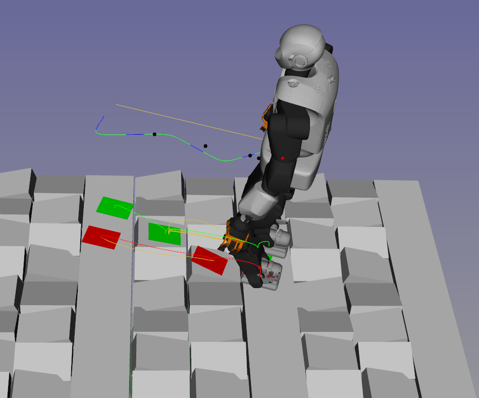

# Loco3D Docker, User Manual

# Summary

## Context

HPP-Loco3D is a complete software for planning locomotion movement, including: contact locations and order ; centroidal
trajectory ; contact timings; contact forces ; whole-body movement. HPP-Loco3D is composed of several software
libraries, dispatched in several repositories. They can be mounted as several CORBA servers. Python scripts are
provided to load the robot model, the scene, formulate the planning problem and get the solution.

The Loco3D docker is a packaging-from-binary solution to help a new user to simply set up the planner and generate new plans. It is designed to be used as a black box. The main envisaged context is massive parallel computation on the cloud, using docker-based architecture. The Loco3D docker is used to generated Deliverable D1.1 of H2020 Memory-of-motion project (Memmo).

## Accessing the dataset 

The dataset can be downloaded with the following links : 

http://hanoi.laas.fr:8080/v1.0/talos_circle.tar.xz

http://hanoi.laas.fr:8080/v1.0/2/talos_circle.tar.xz


http://hanoi.laas.fr:8080/v1.0/talos_circle_oriented.tar.xz

http://hanoi.laas.fr:8080/v1.0/2/talos_circle_oriented.tar.xz


http://hanoi.laas.fr:8080/v1.0/talos_moveEffector_flat.tar.xz

http://hanoi.laas.fr:8080/v1.0/2/talos_moveEffector_flat.tar.xz

http://hanoi.laas.fr:8080/v1.2/talos_moveEffector_flat.tar


http://hanoi.laas.fr:8080/v1.0/talos_moveEffector_stairs_m10.tar.xz

http://hanoi.laas.fr:8080/v1.0/2/talos_moveEffector_stairs_m10.tar.xz


http://hanoi.laas.fr:8080/v1.0/talos_moveEffector_stairs_m15.tar.xz

http://hanoi.laas.fr:8080/v1.0/2/talos_moveEffector_stairs_m15.tar.xz


http://hanoi.laas.fr:8080/v1.0/talos_moveEffector_stairs_p10.tar.xz

http://hanoi.laas.fr:8080/v1.0/2/talos_moveEffector_stairs_p10.tar.xz


http://hanoi.laas.fr:8080/v1.0/talos_moveEffector_stairs_p15.tar.xz

http://hanoi.laas.fr:8080/v1.0/2/talos_moveEffector_stairs_p15.tar.xz


http://hanoi.laas.fr:8080/v1.1/talos_platform_random.tar

http://hanoi.laas.fr:8080/v1.3/talos_randomMove_flat.tar


## Content of the user guide

The [first section](https://github.com/MeMory-of-MOtion/docker-loco3d#test-scenario-description) of the guide describe the various scenarios used. The [second section](https://github.com/MeMory-of-MOtion/docker-loco3d#generated-data) describe the data stored and how to use them.

# Test scenario description

The image currently available use the robot Talos (urdf 'talos_reduced') for all the scenarios, the models can be found in https://gepgitlab.laas.fr/pyrene-dev/talos_data .

## `talos_circle` :


In this scenario the goal position is on a circle of 30cm of radius, with the initial position at it's center. The orientation of the robot in the initial and goal state is always facing the x axis, and this orientation is constrained for the whole motion. This mean that the robot may need to walk sideway or backward to reach the goal state, as shown in the following figures and videos.

Example with the goal state on the left of the circle, leading to a sideway motion.


Example with the goal state on the back of the circle, leading to a backward motion.


Example with the goal state on the top right of the circle.


Example with the goal state on the front of the circle, leading to a straight motion.


## `talos_circle_oriented` :

In this scenario the goal position is on a circle of 1m of radius, with the initial position at it's center. The initial orientation of the robot always face the x axis, but the goal orientation is in the direction of the circle's radius. The robot will thus operate turns to reach the desired goal position/orientation, as shown in the following figures and videos.

Example with the goal state on the left and front of the circle, leading to a straight motion with a small turn.


Example with the goal state on the left of the circle, leading to sharp turn.


Example with the goal state on the back of the circle, leading to a 180 degree turn.


Example with the goal state on the back and right of the circle.


## `talos_moveEffector_flat` :

In this scenario, the initial configuration of the robot is random but with both feet in contact with a flat ground (normal along z and contact position with z=0) and in static equilibrium. The robot will then move one feet (chosen randomly) in a random position in contact with the flat ground. The final configuration is also in static equilibrium.

Example where the right foot move backward.


Example where the right foot move to the right.


## `talos_moveEffector_stairs` :

There is four declination of this scenario : `talos_moveEffector_stairs_m10` , `talos_moveEffector_stairs_p10` , `talos_moveEffector_stairs_m15` , `talos_moveEffector_stairs_p15`. They work the same as the previous one, but instead of having a contact with a floor at z=0 it's either 0 or +- 10 or 15 centimeters.


Example for stairs_m15.


## `talos_platform_random` :

This scenario use an environment composed of rectangular portion of flat floor with lines of inclined patforms in-between. The smaller platform are 30cm long for 20cm width and are inclined of 15 Degree along the x or y axis. You can find the mesh here: https://github.com/pFernbach/hpp-environments/blob/devel/meshes/multicontact/plateforme_not_flat.stl

For this scenario, the robot start on one of the rectangle of flat floor (choosen randomly) with an orientation of +/- 30 degree with respect to the x axis. The goal is to reach another rectangle of flat floor (also choosen randomly) in a straight line.

Example with a motion crossing 2 blocks of uneven platform, in a mostly straight line.


Example with a motion going to the right of the robot.




## `talos_nav_bauzil` :
**TODO : deprecated since v1.0**
This scenario use the environment of our manipulation room and sample randomly an initial and a goal state on the floor of the room. For this scenario, the orientation is also randomly sampled and not constrained during the motion generation.

As the randomly sampled initial and goal states may lead to really difficult problems leading to low success rate of the planner, for this scenario we allow the planner to fail to reach the goal and we save only the first part of the motion up to the last valid state.

## `talos_stairs_bauzil` :
**TODO : deprecated since v1.0**

This scenario use the same environment as the previous one, but the sampling is biased to generate motions on the stairs (either going up or down).
The only difference in the code used between this scenario and the previous one is a tuning of the cost function used by the centroidal dynamic solver, which is required to solve efficiently a problem involving stairs.
This scenario could be solved with the same code as the "navigation in Bauzil room" scenario, but with sub-optimal solutions and a low success rate.


# Generated data

In the generated datasets, all the motions are guarantee to be collision-free, respect the joints limits and the dynamic constraints. In the case of the `circle` scenario all the motions connect exactly the initial state and the goal state, for the other scenario the motion may terminate before the goal state is reached if no valid motion was found to connect the goal.

Each sample of the dataset contains three files :


- `infos.log` give the random configurations sampled (which can be used to re-run this particular problem) and various status indicator of each method. This file can be parsed with the following script : https://github.com/loco-3d/multicontact-locomotion-planning/blob/master/scripts/mlp/utils/status.py

- `*_COM.cs` contains the sequence of contacts (set of active contacts with positions and normals) with the duration of each contact phase and the centroidal trajectory. This is a serialized class (ContactSequenceHumanoid) that can be loaded in python. See package [“multicontact”](https://github.com/loco-3d/multicontact-api) for more information. This dataset have been build with the version 1.1 of multicontact-api. 
As all the information stored in this object are also present in the following archive, this file is mostly used if one want to re-run a specific problem from a given contact sequence or centroidal trajectory.


* `*.npz` Is a serialized numpy archive, created with the method [savez_compressed](https://docs.scipy.org/doc/numpy-1.14.0/reference/generated/numpy.savez_compressed.html). 
This struct contain duplicate of all the information stored in the 'ContactSequence' object, along with all the data from the whole-body motion. 

## Details on the npz archive

An helper script is available to load this archive in a convenient python struct : https://github.com/loco-3d/multicontact-locomotion-planning/blob/master/scripts/mlp/utils/wholebody_result.py

``` Python
import mlp.utils.wholebody_result as wb_res
res = wb_res.loadFromNPZ(npzFilename)
```

This archive store discretized data points, the time step can be accessed with res.dt. For this dataset, the timestep is fixed at 1ms. Each data in this struct is stored in a numpy matrix, with one discretized point per column. 

It store the following information, for a trajectory sample comprising N time-steps, a
robot with a configuration vector of size nq, tangent vector size nv , control vector size nu :

* **t_t** timing vector (1 × N ) (time at each discretized point, from t=0 to t=dt*(N-1))
* **q_t** matrix of joint configurations (nq × N )
* **dq_t** matrix of joint velocities (nv × N )
* **ddq_t** matrix of joint accelerations ( v × N )
* **τ_t** matrix of joint torques (nu × N , for an under-actuated floating-base system nu=nv−6 )
* **c_t** Center of Mass (CoM) positions at each time step (3 × N )
* **dc_t** Center of Mass (CoM) velocities at each time step (3 × N )
* **ddc_t** Center of Mass (CoM) accelerations at each time step (3 × N )
* **L_t** Angular momentum at each time step (3 × N )
* **dL_t** Angular momentum rate at each time step (3 × N )
* **c_reference** Center of Mass (CoM) positions at each time step (3×N ) as computed by the CoM trajectory
optimization
* **dc_reference** Center of Mass (CoM) velocities at each time step (3 × N ) as computed by the CoM
trajectory optimization
* **ddc_reference** Center of Mass (CoM) accelerations at each time step (3 × N ) as computed by the CoM
trajectory optimization
* **L_reference** Angular momentum at each time step (3 × N ) as computed by the CoM trajectory opti-
mization
* **dL_reference** Angular momentum rate at each time step (3 × N ) as computed by the CoM trajectory
optimization
* **wrench_t** Centroidal wrench at each time step (6 × N )
* **zmp_t** Zero Moment Point location at each time step(3 × N )
* **wrench_reference** Centroidal wrench at each time step (6 × N ) as computed by the CoM trajectory opti-
mization
* **zmp_reference** Zero Moment Point location at each time step(3 × N ) as computed by the CoM trajectory opti-
mization

It also store several data related to each end effector, in maps with keys = effector name and value = numpy matrices : 

* **contact_forces**  3d forces at each contact force generator/contact point of
each end-effector. I.e., for a humanoid with rectangular contacts having four discrete contact
points each this amounts to 12 × N per end-effector. (the order and position of the generator used can be found here https://github.com/loco-3d/multicontact-locomotion-planning/blob/master/scripts/mlp/wholebody/tsid_invdyn.py#L33)
* **contact_normal_force** the contact normal force at each end-effector (1 × N
per end-effector).
* **effector_trajectories**  SE(3) trajectory of the effector (the real trajectorie corresponding to the motion in **q_t**) (12 × N per end-effector). This store a column representation of an SE(3) object, see https://github.com/loco-3d/multicontact-locomotion-planning/blob/master/scripts/mlp/utils/util.py#L39
* **effector_references**  reference SE(3) trajectory tracked by the whole-body method  (12 × N per end-effector).
* **contact_activity** binary indicator whether a contact is active (1 × N per end-effector)


Finally, it store the Correspondence between the contact phases and the indexes of discretized points in **phase_intervals**. This field have the same length as the number of contact phases in the motion, and each element is a range of Id. 
For exemple, if we have a motion with three contact phases of 1s each, with a configuration size of 39 and a time step of 1ms. We would have the following : 

```
q_t.shape
```
out : (39,3000)

```
q_t[:,phase_interval[0]].shape
```
out : (39,1000)
which correspond to all the points of the trajectory for the first contact phase of the motion.

Note that by definition of a contact sequence, we have 

```
phase_interval[i][-1] == phase_interval[i+1][0]
```

## Load and play a stored motion :

The package [multicontact-locomotion-planning](https://github.com/loco-3d/multicontact-locomotion-planning) used to generate the motions of the dataset contains a script that can load a motion from the .cs and .npz files, display it in 3D in gepetto-viewer and plot several interesting data. 

Follow the basic installation procedure of this package  (including the installation of gepetto-viewer, but no other optional dependencies) and use the following script : 
https://github.com/loco-3d/multicontact-locomotion-planning/blob/master/scripts/load_motion_from_files.py

Don't forget to run the `gepetto-gui` in a separate terminal.


